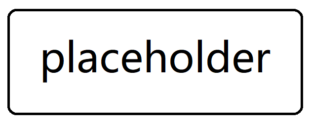

> Update with [`GeDML version=0.2.0`](https://github.com/zbr17/GeDML)

# NAME (TEMPLATE)

This repository is the official PyTorch implementation of **NAME**. 

## Framework

<!--  -->

## Datasets 

<!-- ### CUB-200-2011

Download from [here](http://www.vision.caltech.edu/visipedia/CUB-200-2011.html).

Organize the dataset as follows:

```
- cub200
    |- train
    |   |- class0
    |   |   |- image0_1
    |   |   |- ...
    |   |- ...
    |- test
        |- class100
        |   |- image100_1
        |   |- ...
        |- ...
```

### Cars196

Download from [here](http://ai.stanford.edu/~jkrause/cars/car_dataset.html).

Organize the dataset as follows:

```
- cars196
    |- train
    |   |- class0
    |   |   |- image0_1
    |   |   |- ...
    |   |- ...
    |- test
        |- class98
        |   |- image98_1
        |   |- ...
        |- ...
``` -->

## Requirements

<!-- To install requirements:

```setup
pip install -r requirements.txt
``` -->

## Training

### Baseline models 

<!-- To train ..., run this command:

```python
# python code
``` -->

### Our models

<!-- To train ..., run this command:

```python
# python code
``` -->

## Device 

<!-- We tested our code on a linux machine with an Nvidia RTX ... GPU card. We recommend using a GPU card with a memory > ...GB. -->

## Results

<!-- The baseline models achieve the following performances:

| Model name | Recall @ 1 | Recall @ 2 | Recall @ 4 | Recall @ 8 | NMI |
| - | - | - | - | - | - |
| baseline | 67.3 | 77.7 | 85.7 | 91.4 | 68.7 |

Our models achieve the following performances:

| Model name | Recall @ 1 | Recall @ 2 | Recall @ 4 | Recall @ 8 | NMI |
| - | - | - | - | - | - |
| ours | 68.7 | 78.6 | 86.3 | 91.6 | 69.3 | -->

## COMING SOON

<!-- - [ ] todo. -->